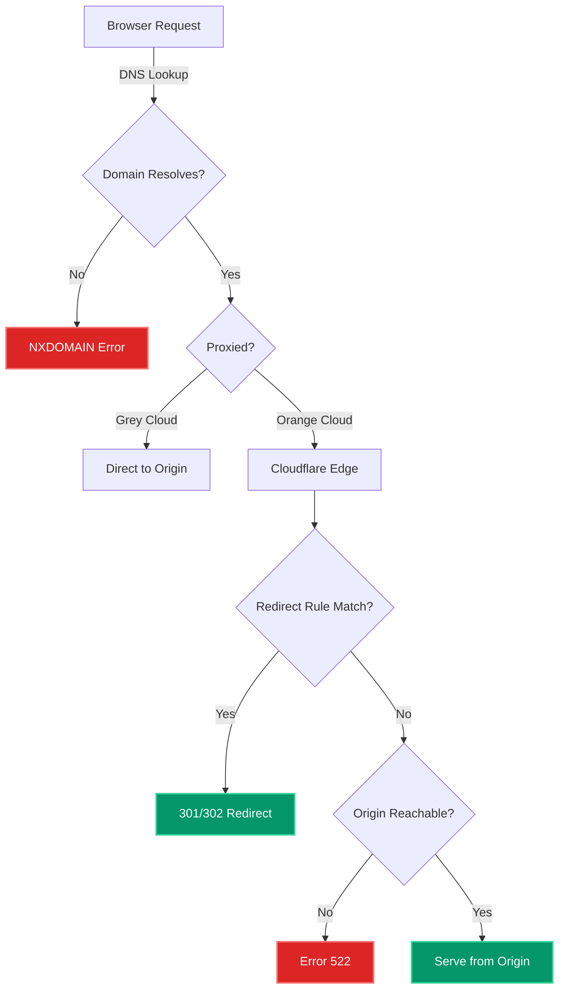

# Mastering Domain Redirects in Cloudflare: A Complete Guide

Domain redirects are one of the most common tasks when managing web infrastructure, whether you're consolidating brands, migrating to a new domain, or simply redirecting www to non-www. Cloudflare makes this powerful, but there are subtle gotchas that can leave you staring at Error 522 or DNS_PROBE_FINISHED_NXDOMAIN for hours.

In this guide, I'll walk you through **exactly** how to redirect domains in Cloudflare, cover the common mistakes that bite developers, and show you how to troubleshoot issues systematically. This comes from real-world experience redirecting bobadilla.work → bobadilla.tech in production.

**What you'll learn:**

- The correct way to set up domain redirects using Cloudflare Redirect Rules
- How DNS records interact with redirect rules (this is where most people fail)
- Troubleshooting Error 522, NXDOMAIN, and other redirect issues
- When to use Redirect Rules vs Page Rules vs Workers
- SEO-safe redirect strategies (301 vs 302)
- Common pitfalls and how to avoid them

**Prerequisites:**

- A Cloudflare account with your domain(s) added
- Basic understanding of DNS (A records, CNAME, etc.)
- Access to Cloudflare Dashboard

---

## Why Domain Redirects Matter

Before diving into implementation, let's understand when and why you need domain redirects:

### Common Use Cases

**Brand consolidation**: You acquired a competitor or are rebranding
- Example: `oldcompany.com` → `newcompany.com`

**Domain standardization**: Redirect www to apex or vice versa
- Example: `www.example.com` → `example.com`

**Multiple domains pointing to one site**: You own several TLDs
- Example: `example.net`, `example.org` → `example.com`

**SEO migration**: Preserving search rankings when changing domains
- Example: All pages from old domain to equivalent pages on new domain

**Protocol enforcement**: HTTP → HTTPS (though Cloudflare handles this automatically)

### SEO Implications

**301 (Permanent)**: Tells search engines this is permanent. Use this 95% of the time.
- Transfers 90-99% of link equity
- Search engines update their index
- Browser caches aggressively

**302 (Temporary)**: Tells search engines this is temporary. Rarely needed.
- Does NOT transfer link equity
- Search engines keep indexing the old URL
- Use for A/B tests or maintenance redirects

**Getting this wrong can tank your SEO** — always use 301 for permanent moves.

---

## The Cloudflare Redirect Architecture

Before configuring anything, understand how Cloudflare processes requests:



**Key insight**: Redirect Rules only fire if:
1. DNS resolves (A/AAAA/CNAME record exists)
2. Domain is proxied (orange cloud 🟠)
3. Request matches the rule condition

Miss any of these? You get errors.

---

## Method 1: Redirect Rules (Recommended)

This is the modern, scalable approach. Cloudflare is moving everything to Redirect Rules, and they're faster and more flexible than legacy Page Rules.

### Step 1: Set Up DNS Records

**Critical requirement**: The source domain MUST resolve, even if you're redirecting everything away from it.

#### For Apex Domain (example.com)

```
Type: A
Name: @
IPv4: 192.0.2.1
Proxy: 🟠 Proxied
TTL: Auto
```

**Why `192.0.2.1`?**
- This is a reserved "dummy" IP (RFC 5737)
- Used for documentation/testing
- Never routes anywhere
- Perfect placeholder when you don't need an actual origin

**Common mistake #1**: Leaving the name as `example.com` instead of `@`

In Cloudflare DNS:
- `@` = root/apex domain
- Cloudflare will display it as `example.com` in the UI (this is correct!)
- If you type `example.com`, Cloudflare creates `example.com.example.com` → NXDOMAIN

#### For WWW Subdomain

```
Type: A
Name: www
IPv4: 192.0.2.1
Proxy: 🟠 Proxied
TTL: Auto
```

**Common mistake #2**: Forgetting the www record

If your redirect rule matches `www.example.com` but no DNS record exists, you get NXDOMAIN.

### Step 2: Create the Redirect Rule

Navigate to: **Rules** → **Redirect Rules** → **Create rule**

#### Simple Example: Redirect Everything

**Rule name**: `Redirect old-domain to new-domain`

**If incoming requests match**:
```
Field: Hostname
Operator: equals
Value: oldcompany.com
```

**Then**:
- Type: `Static redirect`
- URL: `https://newcompany.com/$1`
- Status code: `301`
- ✅ Preserve query string

**Expression preview**:
```
(http.host eq "oldcompany.com")
```

#### Advanced Example: Redirect Apex + WWW

**If incoming requests match**:
```
Field: Hostname
Operator: equals
Value: oldcompany.com

OR

Field: Hostname
Operator: equals
Value: www.oldcompany.com
```

**Expression preview**:
```
(http.host eq "oldcompany.com" or http.host eq "www.oldcompany.com")
```

**Then**:
- Type: `Dynamic redirect`
- Expression: `concat("https://newcompany.com", http.request.uri.path)`
- Status code: `301`
- ✅ Preserve query string

### Step 3: Test Thoroughly

Open an incognito window and test all variations:

```bash
# Apex domain
curl -I http://oldcompany.com
curl -I https://oldcompany.com

# WWW subdomain
curl -I http://www.oldcompany.com
curl -I https://www.oldcompany.com

# With paths
curl -I http://oldcompany.com/about
curl -I http://oldcompany.com/blog/post?id=123
```

**Expected output**:
```
HTTP/2 301
location: https://newcompany.com/about
cf-cache-status: DYNAMIC
```

**Common mistake #3**: Testing in the same browser without clearing cache

301 redirects are cached HARD by browsers. Use:
- Incognito/private mode
- Different browser
- `curl` command line
- Clear browser cache completely

---

## Troubleshooting Common Issues

### Error: DNS_PROBE_FINISHED_NXDOMAIN

**What it means**: Domain doesn't resolve in DNS.

**Cause**: Missing or incorrect DNS record.

**Fix checklist**:
- ✅ A record exists for `@` (not the full domain name)
- ✅ A record exists for `www` (if redirecting www)
- ✅ Records are saved (click Save!)
- ✅ Wait 30-60 seconds for DNS propagation

**Debug command**:
```bash
dig oldcompany.com
dig www.oldcompany.com

# Should show A record pointing to your IP
```

### Error 522: Connection Timed Out

**What it means**: Cloudflare successfully connected to your domain, but the redirect rule didn't fire, so it tried to reach the origin IP and timed out.

**Cause**: Redirect rule not matching the request.

**Fix checklist**:
- ✅ DNS record is **proxied** (🟠 orange cloud)
- ✅ Redirect rule includes ALL hostnames (apex + www)
- ✅ Rule order is correct (should be first)
- ✅ Expression syntax is valid

**Quick fix**: Temporarily set rule to "All incoming requests"

This removes all conditions and guarantees the redirect fires:

**If incoming requests match**: `All incoming requests`

**Then**: (same redirect config)

Once confirmed working, you can tighten it back to specific hostnames.

### Error 521: Web Server Is Down

**What it means**: Cloudflare reached your origin, but it refused the connection.

**Cause**: You have a REAL origin IP (not a dummy), and redirect rule isn't matching.

**Fix**: Use a dummy IP (`192.0.2.1`) since you're redirecting everything anyway.

### Redirect Loop

**What it means**: Browser shows "Too many redirects" or "Redirect loop detected"

**Cause**: Target domain is redirecting back to source domain.

**Fix checklist**:
- ✅ Check redirect rules on BOTH domains
- ✅ Ensure target domain has NO redirect rule pointing back
- ✅ Check `.htaccess` or server config on target
- ✅ Verify Cloudflare SSL mode (should be "Full" or "Full (strict)")

### WWW Not Redirecting

**What it means**: `example.com` works but `www.example.com` doesn't

**Cause**: Missing www DNS record or redirect rule condition.

**Fix**:
1. Add www A record (same as apex)
2. Update redirect rule to include `OR` condition for www
3. Test both in incognito

---

## Real-World Example: bobadilla.work → bobadilla.tech

Let me walk you through a production redirect we implemented.

### Requirements

- Redirect `bobadilla.work` → `bobadilla.tech`
- Redirect `www.bobadilla.work` → `bobadilla.tech`
- Preserve all paths and query strings
- Keep email working on bobadilla.work (MX records)
- SEO-safe (301 permanent)

### Implementation

#### DNS Configuration

```
# bobadilla.work DNS records
Type: A      Name: @      IP: 192.0.2.1    Proxy: 🟠
Type: A      Name: www    IP: 192.0.2.1    Proxy: 🟠
Type: MX     Name: @      Value: ...       Proxy: ☁️ (grey)
Type: TXT    Name: @      Value: ...       Proxy: ☁️ (grey)
```

**Key point**: Email records (MX, TXT) are NOT proxied. Only HTTP/HTTPS traffic goes through Cloudflare edge.

#### Redirect Rule

```
Name: Redirect bobadilla.work to bobadilla.tech
Order: First

If:
(http.host eq "bobadilla.work" or http.host eq "www.bobadilla.work")

Then:
Type: Dynamic
Expression: concat("https://bobadilla.tech", http.request.uri.path)
Status: 301
✅ Preserve query string
```

#### Results

```bash
# Test results
curl -I http://bobadilla.work
→ 301 → https://bobadilla.tech

curl -I http://bobadilla.work/projects
→ 301 → https://bobadilla.tech/projects

curl -I http://www.bobadilla.work/contact?source=email
→ 301 → https://bobadilla.tech/contact?source=email
```

**Performance**:
- Redirect latency: <10ms (edge-based)
- Email unaffected: MX records work normally
- SEO preserved: 301 transfers link equity

---

## Alternative Methods

### Page Rules (Legacy - Not Recommended)

Page Rules are the old way of doing redirects. They still work but have limitations:

**Limitations**:
- Only 3 rules on free plan
- Less flexible matching
- Cloudflare is deprecating in favor of Redirect Rules

**When to use**: Only if you're already heavily invested in Page Rules.

**Configuration**:
```
URL: oldcompany.com/*
Setting: Forwarding URL
Status: 301 - Permanent Redirect
Destination: https://newcompany.com/$1
```

### Cloudflare Workers (Advanced)

Use Workers when you need:
- Complex logic (geo-based redirects, A/B testing)
- Header manipulation
- Custom response codes
- Integration with APIs or databases

**Example Worker**:

```javascript
export default {
	async fetch(request, env) {
		const url = new URL(request.url);

		// Redirect old domain to new domain
		if (url.hostname === "oldcompany.com") {
			url.hostname = "newcompany.com";
			return Response.redirect(url.toString(), 301);
		}

		// Geo-based redirect
		const country = request.cf.country;
		if (country === "GB") {
			return Response.redirect("https://uk.example.com", 302);
		}

		// Pass through to origin
		return fetch(request);
	},
};
```

**Trade-offs**:
- More powerful ✅
- Requires code ❌
- Uses Workers quota ❌
- More complex to debug ❌

Use Redirect Rules unless you NEED the extra power.

---

## Best Practices

### 1. Always Use 301 for Permanent Moves

Unless you have a specific reason (A/B test, temporary maintenance), always use 301.

**Why**:
- Transfers SEO value
- Signals permanence to search engines
- Updates Google's index faster

### 2. Preserve Path and Query Strings

Never redirect everything to the homepage.

**Bad**:
```
oldsite.com/blog/post → newsite.com
```

**Good**:
```
oldsite.com/blog/post → newsite.com/blog/post
oldsite.com/shop?id=123 → newsite.com/shop?id=123
```

**Implementation**: Use dynamic redirects with `http.request.uri.path`

### 3. Test All Variations

Don't assume. Test:
- HTTP and HTTPS
- Apex and www
- With and without trailing slashes
- With query parameters
- With URL fragments

### 4. Monitor After Launch

Use Cloudflare Analytics to verify:
- Redirect status codes (should see lots of 301s)
- No 4xx or 5xx errors
- Traffic landing on target domain

Check Google Search Console:
- Submit new sitemap
- Monitor index coverage
- Check for redirect chains

### 5. Keep Email Records Separate

**Important**: MX and TXT records should be:
- ☁️ DNS-only (grey cloud)
- NOT proxied through Cloudflare

Redirects only affect HTTP/HTTPS traffic, but mixing them up can cause confusion.

---

## Redirect Checklist

Use this before going live:

**DNS Setup**:
- [ ] A record for apex (`@`) exists
- [ ] A record for www exists (if needed)
- [ ] Both records are proxied (🟠 orange cloud)
- [ ] IP can be dummy (`192.0.2.1`) if redirecting everything
- [ ] Email records (MX, TXT) are grey-clouded

**Redirect Rule**:
- [ ] Rule matches all hostnames (apex + www)
- [ ] Dynamic redirect preserves path
- [ ] Query string preservation enabled
- [ ] Status code is 301 (permanent)
- [ ] Rule order is "First"

**Testing**:
- [ ] Test HTTP apex domain
- [ ] Test HTTPS apex domain
- [ ] Test HTTP www subdomain
- [ ] Test HTTPS www subdomain
- [ ] Test with path: `/about`, `/blog/post`
- [ ] Test with query string: `?id=123&source=email`
- [ ] Test in incognito/curl (avoid cache)

**Post-Launch**:
- [ ] Monitor Cloudflare Analytics for 301 status codes
- [ ] Check Google Search Console for crawl errors
- [ ] Submit new sitemap to search engines
- [ ] Update any hardcoded links in marketing materials
- [ ] Set up monitoring/alerts for 5xx errors

---

## Advanced Patterns

### Pattern 1: Redirect Multiple Domains to One

```
Domain A → target.com
Domain B → target.com
Domain C → target.com
```

**Solution**: Create separate rules for each, or use regex:

```
If:
http.host matches "^(domainA|domainB|domainC)\.com$"

Then:
concat("https://target.com", http.request.uri.path)
```

### Pattern 2: Subdomain-Specific Redirects

```
blog.oldsite.com → newsite.com/blog
shop.oldsite.com → newsite.com/shop
```

**Solution**: Use path manipulation:

```
If:
http.host eq "blog.oldsite.com"

Then:
concat("https://newsite.com/blog", http.request.uri.path)
```

### Pattern 3: Redirect with Path Rewriting

```
oldsite.com/old-blog/post → newsite.com/blog/post
```

**Solution**: Use regex_replace:

```
Expression:
regex_replace(
  http.request.uri.path,
  "^/old-blog",
  "https://newsite.com/blog"
)
```

### Pattern 4: Conditional Redirects (Workers)

Redirect based on user agent, country, or custom logic:

```javascript
export default {
	async fetch(request) {
		const url = new URL(request.url);
		const country = request.cf.country;
		const userAgent = request.headers.get("user-agent");

		// Mobile users go to mobile site
		if (userAgent.includes("Mobile")) {
			url.hostname = "m.example.com";
			return Response.redirect(url.toString(), 302);
		}

		// EU users go to EU site
		if (["GB", "FR", "DE"].includes(country)) {
			url.hostname = "eu.example.com";
			return Response.redirect(url.toString(), 302);
		}

		return fetch(request);
	},
};
```

---

## Performance Considerations

### Edge-Based Redirects Are Fast

Cloudflare Redirect Rules execute at the edge (275+ locations worldwide):

- **Latency**: <10ms typical
- **No origin hit**: Redirect happens before reaching your server
- **Cached responses**: Browsers cache 301s aggressively

### Redirect Chains Are Bad

Avoid:
```
domainA.com → domainB.com → domainC.com
```

**Why**:
- Each redirect adds latency
- Poor user experience
- SEO penalty (link equity dilution)
- More failure points

**Solution**: Always redirect directly to final destination.

### DNS Resolution Time

First-time visitors must:
1. Resolve DNS (typically <50ms with Cloudflare)
2. TLS handshake
3. Redirect
4. Resolve target DNS
5. TLS handshake again
6. Load content

**Optimization**: Use the same DNS provider for both domains (Cloudflare for both).

---

## Security Implications

### Open Redirect Vulnerability

**Bad** (never do this):
```javascript
// Vulnerable to open redirect
const target = new URL(request.url).searchParams.get("redirect");
return Response.redirect(target, 302);
```

**Attack**:
```
https://yoursite.com/?redirect=https://evil.com
→ Redirects to evil.com
```

**Good** (Cloudflare Redirect Rules):
```
Static or dynamic redirects to hardcoded domains
No user input in redirect destination
```

### HTTPS Enforcement

Always redirect to `https://`, not `http://`:

**Bad**:
```
concat("http://newsite.com", http.request.uri.path)
```

**Good**:
```
concat("https://newsite.com", http.request.uri.path)
```

Cloudflare will auto-upgrade to HTTPS, but be explicit.

---

## Cost Considerations

### Free Plan

**Redirect Rules**: Unlimited
**Page Rules**: 3 (limited)
**Workers**: 100,000 requests/day

For simple redirects, the **free plan is sufficient**.

### Paid Plans

**Pro ($20/month)**: 20 Page Rules (but use Redirect Rules instead)
**Business ($200/month)**: More advanced rules, priority support
**Enterprise**: Custom everything

**Recommendation**: Redirect Rules on free plan handle 99% of use cases.

---

## Migration Strategy

### Before Migration

1. **Audit existing URLs**: Export sitemap, analytics top pages
2. **Create redirect mapping**: Old URL → New URL (CSV or spreadsheet)
3. **Test on staging**: Set up redirects on test domain first
4. **Backup everything**: DNS records, existing rules

### During Migration

1. **Set up DNS first**: Ensure all domains resolve
2. **Create redirect rules**: Test each one
3. **Monitor in real-time**: Watch Cloudflare Analytics
4. **Have rollback plan**: Keep old DNS records handy

### After Migration

1. **Monitor for 48 hours**: Check error rates, analytics
2. **Update search engines**: Submit new sitemap
3. **Update external links**: Social media, email signatures
4. **Keep redirects forever**: Don't remove them (SEO!)

---

## Conclusion

Cloudflare domain redirects are powerful, fast, and free — when configured correctly. The key lessons:

**Critical requirements**:
- DNS must resolve (A record with 🟠 orange cloud)
- Use `@` for apex, not the full domain name
- Include www in redirect rules if you use it
- Always test in incognito/curl

**Best practices**:
- Use 301 for permanent redirects
- Preserve paths and query strings
- Test all variations (HTTP/HTTPS, apex/www)
- Monitor after launch

**Troubleshooting**:
- NXDOMAIN = DNS record missing or wrong name
- Error 522 = Redirect rule not matching
- Redirect loop = Check both source and target domains

**When to use what**:
- **Redirect Rules**: 99% of cases (modern, unlimited, fast)
- **Page Rules**: Only if already using them (legacy)
- **Workers**: Complex logic, geo-routing, custom code

The redirect from bobadilla.work → bobadilla.tech took 5 minutes to configure once I understood these principles. Follow this guide and yours will too.

---

**Have questions or hit a weird edge case?** Open an issue on [GitHub](https://github.com/bobadilla-tech/agency-landing) or email us at [ale@bobadilla.tech](mailto:ale@bobadilla.tech).

**Need help with Cloudflare setup, migrations, or architecture?** We offer consulting and implementation services — [get in touch](https://bobadilla.tech/#contact).
